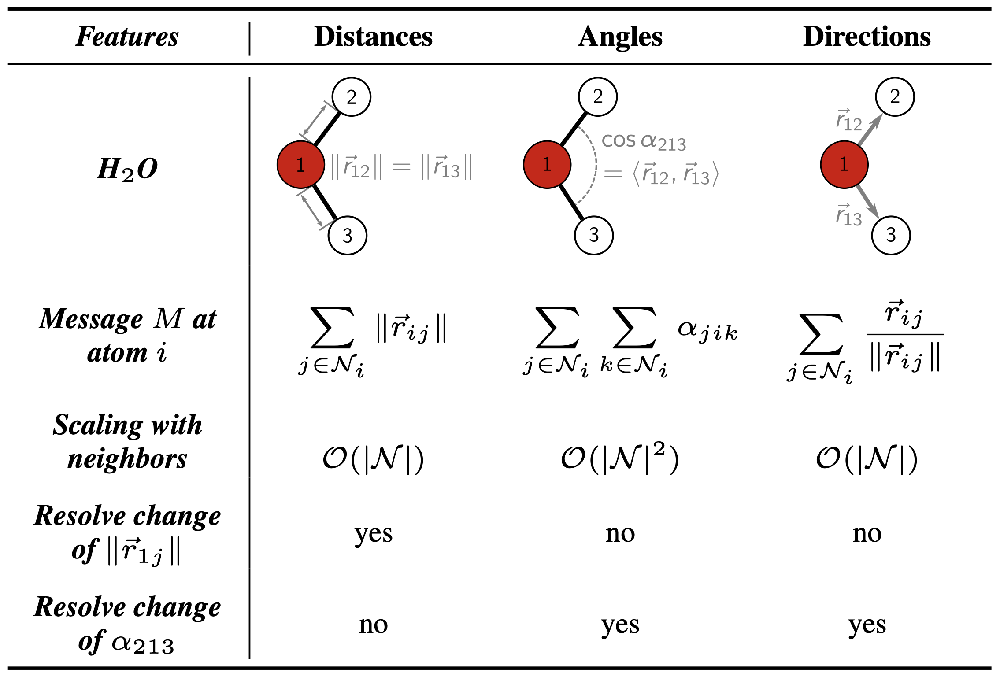
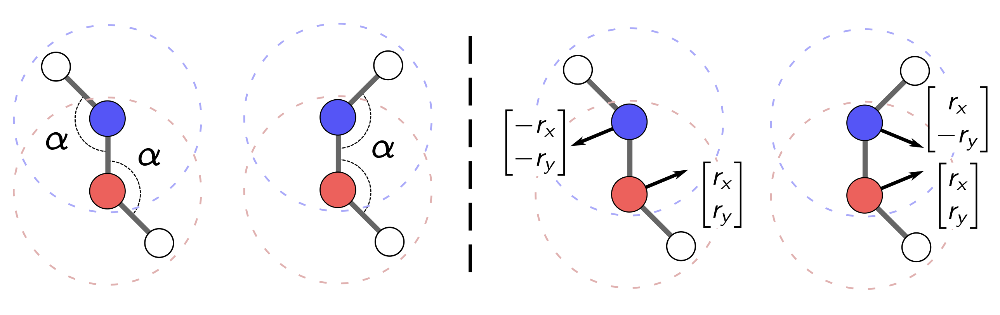
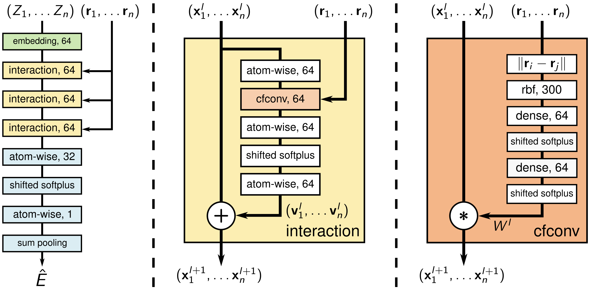

# Molecular Dynamics with Neural Networks

This project was part of a six-month, part-time research assistant position under the supervision of Professor Enrico Tapavicza. The main goal is to speed up the simulation of molecular dynamics (MDs) of a second-generation Feringa-type molecular nanomotor. In our case this is 9-(2’-methyl-2’,3’-dihydro-1’H-cyclopenta[a]naphthalen-1’-ylidene)-9H-xanthene (CPNX) (see for example the [paper](https://pubs.rsc.org/en/content/articlepdf/2025/cp/d5cp01063b)). 

## PaiNN

SchNet’s architecture is designed for predicting scalar-valued properties, and can only produce vector properties that are direct derivatives of these scalars (e.g., forces obtained as the negative gradient of the energy). Predicting general vector quantities, such as non-adiabatic couplings (NACs), requires extending this framework. This is achieved by the **Polarizable Atom Interaction Neural Network** (PaiNN).

In PaiNN, a molecule is represented as a graph where each atom is a node equipped with both a scalar feature representation $s^{t}_i \in \mathbb{R}^F$ and a vectorial feature representation $\mathbf{v}^t_i \in \mathbb{R}^{3 \times F}$, where $F$ is the embedding dimension and the first dimension corresponds to the three spatial coordinates.

As in SchNet, PaiNN models local interactions through a message passing mechanism. A key benefit of vectorial features is that they allow the network to capture changes in bond angles without introducing explicit angular terms, thereby avoiding additional computational cost (see figure below).

<p align="center">
   
</p>

Furthermore, PaiNN can distinguish molecular conformations that differ by rotations around bonds, as shown in the following figure.


<p align="center">
   
</p>


The updates of scalar and vectorial representation are constructed to ensure rotational invariance and equivariance, respectively.

## Outline

1. [Project Structure](#project-structure)
2. [Ground State Molecular Dynamics](#ground-state-molecular-dynamics)
   - [Data Overview](#data-overview)
   - [Installation](#installation)
   - [Workflow](#workflow)
3. [Excited State Molecular Dynamics](#excited-state-molecular-dynamics)
   - [Data Overview](#data-overview)
   - [Installation](#installation)
   - [Workflow](#workflow)
4. [Resources](#resources)
5. [Theory](#theory)
6. [Contributing](#contributing)
7. [License](#license)

# Project Structure

This project is split into two main parts, namely the **ground_state_md** and **excited_state_md** directories. The training of neural networks (NNs) to predict ground state MDs is done by employing the [SchNetPack](https://github.com/atomistic-machine-learning/schnetpack) package, whereas the [SPaiNN](https://pubs.rsc.org/en/content/articlepdf/2024/sc/d4sc04164j) package was used to train NNs for the prediction of excited state trajectories. The main differences between these two tasks are summarized below.

|                                      | Ground State MD (`ground_state_md`)               | Excited State MD (`excited_state_md`)                      |
|--------------------------------------|---------------------------------------------------|-----------------------------------------------------------|
| Target Properties                    | Potential energy S0 and resulting forces          | Potential energies S0 and S1, resulting forces and non‑adiabatic couplings S0 -> S1 |
| Training Data                        | Ground‑state trajectories using xTB with REMD     | Excited‑state MD with TDDFT and FSSH based on configurations from ground-state xTB trajectories |
| ML Framework                         | SchNetPack + ASE Interface                        | SPaiNN (PaiNN + SchNetPack + SHARC interface) |
| Dynamics Setup                       | Adiabatic MD on a single potential energy surface (PES) | Non‑adiabatic MD using FSSH  (via SHARC)  |

Since I started with the code for ground state MD without knowing the exact direction of this project, much of the code for the excited state MD is based on or directly using code from ground_state_md.
The "deprecated" directory contains every outdated piece of code, that at some point may be removed from this project.

# Ground State Molecular Dynamics

## Data Overview

The dataset used for training the neural network consists of five replica exchange molecular dynamics (REMD) simulations performed with the extended tight binding (xTB) software. The simulations were carried out on the CPNX nanomotor which consists of 48 atoms ($OC_{27}H_{20}$), and the data includes information about atomic positions, energies, forces and velocities. Different dihedral angles were defined in order to cluster the sampled structures into the following four conformations: "syn-M", "anti-M", "syn-P" and "anti-P". See the [paper](https://pubs.rsc.org/en/content/articlepdf/2025/cp/d5cp01063b) by Lucia-Tamudo et al. for more details on the underlying data and this clustering. The evolution of the dihedral angles for one of the simulations (T300_1) can be viewed [here](https://FerdinandToelkes.github.io/whk/dihedral_angles_MOTOR_MD_XTB_T300_1.html). As one can see, the configurations of this simulations are mostly in the anti-M conformation. Throughout the following we will only focus on the T300_1 data when training our networks.


## Installation

Once you have cloned this project, you can use the environment.yaml file within the ground_state_md folder to build the conda environment needed to execute the project code. The needed commands are as follows:


```bash
git clone git@github.com:FerdinandToelkes/whk.git
cd /path/to/cloned/directory
conda env create -f ground_state_md/environment.yml
conda activate schnet
```

## Workflow

Each script should include an example of how to execute it at the top. All python scripts are to be executed from the root directory of the project. The "target_dir" as well as the "trajectory_dir" parameters have to be set relative to the data directory (see also set_data_prefix within utils.py). In my case, we could have target_dir = MOTOR_MD_XTB/T300_1.

### Preprocessing

- Obtain gradients, positions and velocities from mdlog.i files with the extract.py script:
```bash
python -m ground_state_md.preprocessing.extract \
    --property gradients \
    --target_dir path/to/dir/with/mdlog.i/files
```
- Obtain energies from mdlog.i files with Turbomole by executing directly in the directory with the mdlog.i files (make sure that Turbomole is installed and enabled):
```bash
log2egy > energies.txt
```
- Transform the extracted properties into a .db file (which is the format used within SchNetPack) by employing the prepare_xtb_data.py script
```bash
python -m ground_state_md.preprocessing.prepare_xtb_data \
    --trajectory_dir path/to/dir/with/mdlog.i/files \
    --num_atoms 48 --position_unit angstrom \
    --energy_unit kcal/mol --time_unit fs
```
- Define how the data later should be splitted into training, validation and test data via the create_splits.py script:
```bash
python -m ground_state_md.preprocessing.create_splits \
    --trajectory_dir path/to/dir/with/mdlog.i/files \
    --units angstrom_kcal_per_mol_fs 
```
- If needed, compute the mean and standard deviation of the various properties in the training set via the compute_means_and_stds.py script:
```bash
python -m ground_state_md.preprocessing.compute_means_and_stds \
    --trajectory_dir path/to/dir/with/mdlog.i/files \
    --num_atoms=48 --units angstrom_kcal_per_mol_fs
```
Note that paths need to be updated depending on the local setup especially of the data. 

### Training and Inference

- Use train.py to train a neural network via SchNetPack (adjust parameters via the command line or the .yml config file if necessary)
```bash
screen -dmS xtb_train sh -c 'python -m ground_state_md.training_and_inference.train \ 
    --trajectory_dir path/to/dir/with/mdlog.i/files --epochs 1000  \ 
    --batch_size 100 --learning_rate 0.0001 --seed 42 \
    --config_name train_config_default_transforms 
    --units angstrom_kcal_per_mol_fs; exec bash'
```
- Use get_test_metrics.py to predict the energies, forces and gradients of the test set with the trained model
```bash
python -m ground_state_md.training_and_inference.get_test_metrics \
    --model_dir MOTOR_MD_XTB/T300_1/epochs_1000_bs_100_lr_0.0001_seed_42
```
- Run inference_with_ase.py to generate a MD trajectory starting from a configuration within the test dataset
```bash
screen -dmS inference_xtb sh -c \
    'python -m ground_state_md.training_and_inference.inference_with_ase \
    --model_dir MOTOR_MD_XTB/T300_1/epochs_1000_bs_100_lr_0.0001_seed_42 \
    --units angstrom_kcal_per_mol_fs --md_steps 100 --time_step 0.5 ; exec bash'
```
- Execute ~~order 66~~ the plot_interactive_md_ase_sim.py script in order to gain an overview of the various energies from the two trajectories as well as their correlation 
```bash
python -m ground_state_md.training_and_inference.plot_interactive_md_ase_sim \
    --model_dir MOTOR_MD_XTB/T300_1/epochs_1000_bs_100_lr_0.0001_seed_42 \
    --simulation_name  md_sim_steps_5000_time_step_1.0_seed_42 \
    --n_samples 5000 --units angstrom_kcal_per_mol_fs
```

## Results

Here is a quick overview of results for training a neural network on the MOTOR_MD_XTB/T300_1 dataset. We used the trained model to run a MD and the plots show a comparison between the model's prediction for the energies with predictions made by xTB that can be viewed [here](https://FerdinandToelkes.github.io/whk/angstrom_kcal_per_mol_fs/MOTOR_MD_XTB/T300_1/epochs_1000_bs_100_lr_0.0001_seed_42/md_sim_steps_5000_time_step_1.0_seed_42/interactive_properties_plot.html) and the corresponding rolling correlation between the energies, that is displayed in [this plot](https://FerdinandToelkes.github.io/whk/angstrom_kcal_per_mol_fs/MOTOR_MD_XTB/T300_1/epochs_1000_bs_100_lr_0.0001_seed_42/md_sim_steps_5000_time_step_1.0_seed_42/interactive_rolling_corr_plot.html)
 
# Excited State Molecular Dynamics

## Data Overview

## Data Overview

The models for predicting excited state trajectories are trained on the same molecule as in the ground state case, but now using excited state data. This data was generated with time-dependent density functional theory (TDDFT) combined with fewest switches surface hopping (FSSH) to model electronic transitions.

Several excited state trajectories were simulated. Their starting configurations were taken at regular intervals from one long ground state molecular dynamics (MD) simulation using xTB. Each excited state trajectory is stored in a folder named `GEO_i`, where `i` corresponds to the time step of its starting configuration in the underlying ground state MD.

An example of the energy profile of such an excited state trajectory can be viewed [here](https://FerdinandToelkes.github.io/whk/energies_PREPARE_12_GEO_100000_test.html). This example is taken from 'GEO_100000'.


## Installation

Once you have cloned this project, you can use the environment.yaml file within the excited_state_md folder to build the conda environment needed to execute the project code. The needed commands are as follows:


```bash
git clone git@github.com:FerdinandToelkes/whk.git
cd /path/to/cloned/directory
conda env create -f excited_state_md/environment.yml
conda activate schnet
```

## Workflow

Each script should include an example of how to execute it at the top. All python scripts are to be executed from the root directory of the project. The "target_dir" as well as the "trajectory_dir" parameters have to be set relative to the data directory (see also set_data_prefix within utils.py). In my case, we could have target_dir = MOTOR_MD_XTB/T300_1.

### Preprocessing

- Obtain gradients, positions and velocities from mdlog.i files with the extract.py script:
```bash
python -m ground_state_md.preprocessing.extract \
    --property gradients \
    --target_dir path/to/dir/with/mdlog.i/files
```
- Obtain energies from mdlog.i files with Turbomole by executing directly in the directory with the mdlog.i files (make sure that Turbomole is installed and enabled):
```bash
log2egy > energies.txt
```
- Transform the extracted properties into a .db file (which is the format used within SchNetPack) by employing the prepare_xtb_data.py script
```bash
python -m ground_state_md.preprocessing.prepare_xtb_data \
    --trajectory_dir path/to/dir/with/mdlog.i/files \
    --num_atoms 48 --position_unit angstrom \
    --energy_unit kcal/mol --time_unit fs
```
- Define how the data later should be splitted into training, validation and test data via the create_splits.py script:
```bash
python -m ground_state_md.preprocessing.create_splits \
    --trajectory_dir path/to/dir/with/mdlog.i/files \
    --units angstrom_kcal_per_mol_fs 
```
- If needed, compute the mean and standard deviation of the various properties in the training set via the compute_means_and_stds.py script:
```bash
python -m ground_state_md.preprocessing.compute_means_and_stds \
    --trajectory_dir path/to/dir/with/mdlog.i/files \
    --num_atoms=48 --units angstrom_kcal_per_mol_fs
```
Note that paths need to be updated depending on the local setup especially of the data. 

### Training and Inference

- Use train.py to train a neural network via SchNetPack (adjust parameters via the command line or the .yml config file if necessary)
```bash
screen -dmS xtb_train sh -c 'python -m ground_state_md.training_and_inference.train \ 
    --trajectory_dir path/to/dir/with/mdlog.i/files --epochs 1000  \ 
    --batch_size 100 --learning_rate 0.0001 --seed 42 \
    --config_name train_config_default_transforms 
    --units angstrom_kcal_per_mol_fs; exec bash'
```
- Use get_test_metrics.py to predict the energies, forces and gradients of the test set with the trained model
```bash
python -m ground_state_md.training_and_inference.get_test_metrics \
    --model_dir MOTOR_MD_XTB/T300_1/epochs_1000_bs_100_lr_0.0001_seed_42
```
- Run inference_with_ase.py to generate a MD trajectory starting from a configuration within the test dataset
```bash
screen -dmS inference_xtb sh -c 'python -m ground_state_md.training_and_inference.inference_with_ase \
    --model_dir MOTOR_MD_XTB/T300_1/epochs_1000_bs_100_lr_0.0001_seed_42 \
    --units angstrom_kcal_per_mol_fs --md_steps 100 --time_step 0.5 ; exec bash'
```
- Execute ~~order 66~~ the plot_interactive_md_ase_sim.py script in order to gain an overview of the various energies from the two trajectories as well as their correlation 
```bash
python -m ground_state_md.training_and_inference.plot_interactive_md_ase_sim \
    --model_dir MOTOR_MD_XTB/T300_1/epochs_1000_bs_100_lr_0.0001_seed_42 \
    --simulation_name  md_sim_steps_5000_time_step_1.0_seed_42 \
    --n_samples 5000 --units angstrom_kcal_per_mol_fs
```

## Results

Here is a quick overview of results for training a neural network on the MOTOR_MD_XTB/T300_1 dataset. We used the trained model to run a MD and the plots show a comparison between the model's prediction for the energies with predictions made by xTB that can be viewed [here](https://FerdinandToelkes.github.io/whk/angstrom_kcal_per_mol_fs/MOTOR_MD_XTB/T300_1/epochs_1000_bs_100_lr_0.0001_seed_42/md_sim_steps_5000_time_step_1.0_seed_42/interactive_properties_plot.html) and the corresponding rolling correlation between the energies, that is displayed in [this plot](https://FerdinandToelkes.github.io/whk/angstrom_kcal_per_mol_fs/MOTOR_MD_XTB/T300_1/epochs_1000_bs_100_lr_0.0001_seed_42/md_sim_steps_5000_time_step_1.0_seed_42/interactive_rolling_corr_plot.html)

# Resources

## Data
- [First principles prediction of wavelength-dependent isomerization quantum yields of a second-generation molecular nanomotor](https://pubs.rsc.org/en/content/articlepdf/2025/cp/d5cp01063b)

## Ground State Dynamics
- [SchNetPack: A Deep Learning Toolbox For Atomistic Systems](https://pubs.acs.org/doi/pdf/10.1021/acs.jctc.8b00908)
- [SchNetPack documentation](https://schnetpack.readthedocs.io/en/latest/)
- [SchNetPack GitHub Page](https://github.com/atomistic-machine-learning/schnetpack)
- [SchNet – A deep learning architecture for molecules and materials](https://pubs.aip.org/aip/jcp/article/148/24/241722/962591/SchNet-A-deep-learning-architecture-for-molecules)
- [Equivariant Message Passing for the Prediction of Tensorial Properties and Molecular Spectra](https://proceedings.mlr.press/v139/schutt21a/schutt21a.pdf)

## Excited State Dynamics
- [SPAINN: equivariant message passing for excited-state nonadiabatic molecular dynamics](https://pubs.rsc.org/en/content/articlepdf/2024/sc/d4sc04164j)
- [SpaiNN documentation](https://spainn.readthedocs.io/en/latest/index.html)
- [SpaiNN GitHub Page](https://github.com/CompPhotoChem/SPaiNN)
- [Nonadiabatic dynamics: The SHARC approach](https://wires.onlinelibrary.wiley.com/doi/pdfdirect/10.1002/wcms.1370)
- [Pedagogical Overview of the Fewest Switches Surface Hopping Method](https://pubs.acs.org/doi/pdf/10.1021/acsomega.2c04843?ref=article_openPDF)
- [Ab initio non-adiabatic molecular dynamics](https://pubs.rsc.org/en/content/articlepdf/2013/cp/c3cp51514a)

## General Methods
- [Dynamic Filter Networks](https://proceedings.neurips.cc/paper/2016/file/8bf1211fd4b7b94528899de0a43b9fb3-Paper.pdf)
- [Neural Message Passing for Quantum Chemistry](https://proceedings.mlr.press/v70/gilmer17a/gilmer17a.pdf)
- [Graph Neural Networks Series (Blog post)](https://medium.com/the-modern-scientist/graph-neural-networks-series-part-4-the-gnns-message-passing-over-smoothing-e77ffee523cc)
- [Lecture Notes on Data Analysis](https://indico.in2p3.fr/event/2086/contributions/22818/attachments/18562/22658/cowan_statnote.pdf)

# Theory

## SchNet

The SchNet model predicts molecular energies and forces from atomic positions and types. It respects key physical symmetries: energies are rotationally invariant, forces are rotationally equivariant, and both are invariant under translations and permutations of atoms of the same type. Forces are computed in a physically consistent manner by applying automatic differentiation to the predicted energy.

SchNet can be framed as a message passing neural network, where the message function $M$ is implemented using continuous-filter convolutions (see below), and the update function $U$ is element-wise addition.

The architecture of SchNet is shown in the figure below (adapted from the original SchNet paper). In the following, we examine its components in more detail.

<p align="center">
   
</p>

Lets begin by talking about the different components of this architecture.

- **Embedding:** In the simplest description, an atom can be identified by its atomic number *Z*. While *Z* is just a single integer, it correlates with a wealth of chemical properties, such as valence electron count, electronegativity, typical bonding patterns, and orbital hybridization, arising from quantum mechanics and periodic trends. To represent this rich information in a way a neural network can use, each atom type *Z_i* is mapped to a vector $x_i^{0} = a_{Z_i}$, called an embedding. These vectors are initially assigned random values and are optimized during training so the network can learn a representation that captures the relevant chemical behavior for the dataset at hand.
- **Atom-wise Layers:** A linear layer $x^{l+1}_i = W^{l} x^{l}_i + b^l$, where the weights $W^{l}$ and biases $b^l$ are shared across all atoms in layer $l$. This weight sharing preserves permutation invariance and allows the model to scale to molecules of different sizes.
- **Dense Layer**: A linear layer without any sharing of weights. 
- **Shifted Softplus:** The activation function $\text{ssp}(x) = \ln(0.5 e^x + 0.5)$ introduces non-linearity into the network. Its smoothness and non-zero gradient at $x = 0$ make it a common choice in atomistic neural networks.
- **Sum Pooling:** The atom embeddings $(x_1,\dots,x_n)$ of the molecule are not directly combined while being passed through the network. At the final stage, they are aggregated into a single molecular representation. For extensive properties (e.g., total energy), the outputs of the last atom-wise layer are summed, e.g. $E = \sum_{i=1}^n e_i$. For intensive properties (e.g., average energy per atom), they are averaged instead. This aggregation step is referred to as sum pooling.

### Continuous-filter Convolutions to Model Inter-atomic Interactions

To incorporate the influence of atoms on each other, the architecture employs interaction blocks (see the middle panel of the figure above). These blocks have a residual structure and use continuous-filter convolutions to model interactions between atoms within a given cutoff radius. Multiple interaction blocks lead to the propagation of local information beyond the cutoff radius.

The convolution filters depend on the atomic positions $(r_1, \dots, r_n)$, more precisely, on the interatomic distances $r_{ij} = \lVert r_i - r_j \rVert$. This dependency ensures rotational invariance of the predicted scalar property. 

For richer context, each distance $r_{ij}$ is expanded into a vector $\varphi(r_{ij})$ using $m$ Gaussian radial basis functions (RBFs) with different centers (in our case, $m=300$). A multilayer perceptron (MLP) then maps this expanded vector to a convolution filter $W(r_{ij}) = \mathrm{MLP}(\varphi(r_{ij}))$. In our case, the MLP consists of two dense layers, each followed by a shifted softplus function. Finally, the updated atom-wise features are computed as $x_{i}^{l+1} = \sum_j x_j^{l} \circ W^{l}(r_{ij})$, where $\circ$ denotes element-wise multiplication.

The advantage of using an additional neural network to generate filters conditioned on atomic positions is that it allows the model to handle interactions at arbitrary positions in continuous space, whereas conventional convolutional filters are designed for fixed, grid-like data structures (e.g., images).


# Unfinished Thoughts on Change of Units

TODO: try to add handwritten document.

# Contributing

If you would like to contribute to the project, please open an issue or a pull request.

# License

This project is licensed under the MIT License - see the LICENSE file for details.

